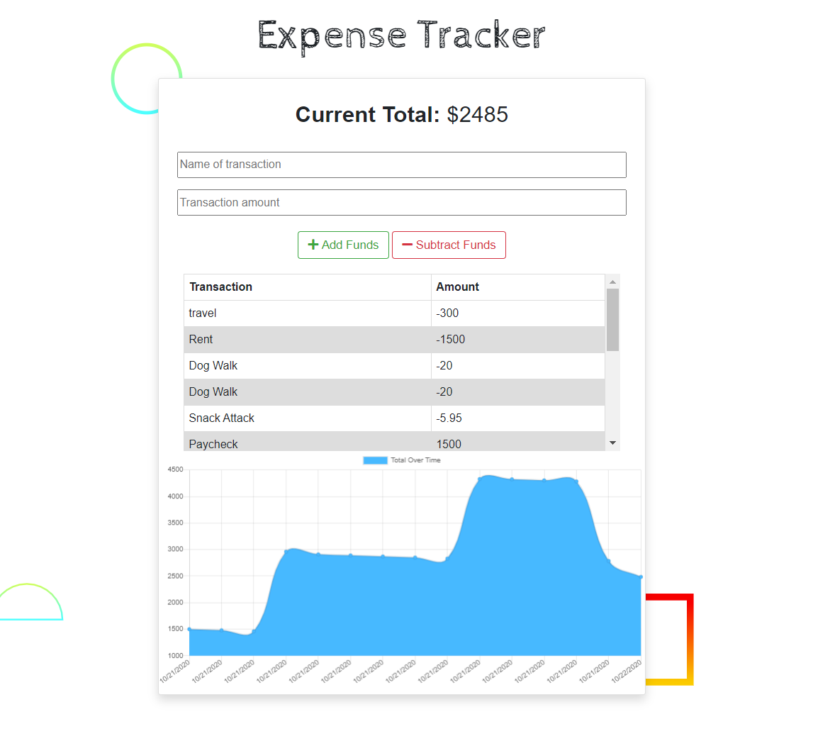

# Expense Tracker PWA 

[](https://choosealicense.com/licenses/mit/)




    
#### Check it out: [Deployed on Heroku](https://aiden-expense-tracker.herokuapp.com/)

## Description

**Expense Tracker PWA** is a progressive web application that allows the user to add expenses and deposits to their budget with or without a connection.

---

#### Table of Contents

* [Deployed Application](#check)
* [Description](#description)
* [User Story](#user)
* [Demo](#demo)
* [Technologies Used](#technologies)
* [License](#license)
* [Contributing](#contributing)
* [Questions](#questions)

---

### User Story

```
AS AN avid traveller
I WANT to be able to track my withdrawals and deposits with or without a data/internet connection
SO THAT my account balance is accurate when I am traveling
```

### Demo 


Test it out for yourself: [Deployed on Heroku](https://aiden-expense-tracker.herokuapp.com/)

### Technologies Used

* MongoDB
* Mongoose
* Express
* Morgan
* Compression
* Heroku
* Dotenv

### Contributing

If you'd like to contribute to this application, feel free to submit a pull request.

#### License

This project is licensed under MIT. 

#### Questions

    

If you have any questions, please [email me.](mailto:aiden.threadgoode@gmail.com)

If you'd like to see more of my work, feel free to check out [my github!](https://github.com/a-thread)

*© 2020 Aiden Threadgoode*

    
